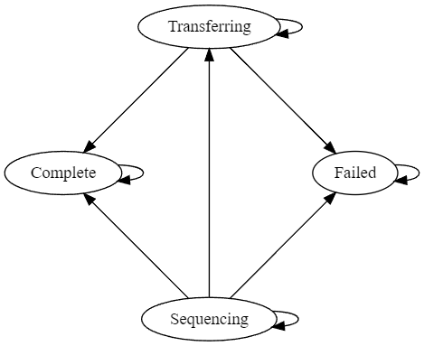

seqdir
----------

## This library is under initial development and has not yet been released. Feel free to use, explore, and modify at your own risk.

seqdir is a simple library for monitoring the state of Illum*na sequencing runs. It attempts to be small and lightweight. seqdir events are serializeable to \<your favorite format\>.

### Design

seqdir is implemented in two main components. The `SeqDir` struct provides methods for querying about the state of a sequencing directory (rooted to a filesystem path).
The `DirManager` struct implements a state-machine on top of a SeqDir. Every time the manager is polled, the state may transition according to the following rules:



Self-transitions are explicitly encoded because the availability of the directory may change even if the state does not.

Complete and Failed are terminal states. They can only ever transition to themselves (availability may change during said transition).

The `run_completion` module also provides methods for parsing RunCompletionStatus.xml files.

### Serialization Examples

Serialized to JSON, a SeqDirState looks like

```{json}
{
  "state": "Complete",
  "available": true,
  "root": "test_data/seq_complete/",
  "since": "2024-01-13T02:00:00.892711400Z"
}
```

and a CompletionStatus looks like

```{json}
{
  "completion_status": "CompletedAsPlanned",
  "run_id": "20231231_foo_ABCXYZ",
  "message": null
}
```

### Panics

This library does not panic. Any panics within this library should be considered a bug and be reported.

### Stability

This library is currently unstable (obviously). Especially subject to change is the handling of lanes, cycles, and bcls, as I am particularly unhappy with the current design.

### CHANGELOG
Please see [CHANGELOG](CHANGELOG) for the release history.

### Pre-emptively Answered Questions (PAQ)
Q: Will you support other sequencing platforms?
A: Maybe. Initially, only Illumina is supported because that is the platform I work with professionally.

   If you want to see other platforms supported, submit an issue with sufficient documentation to implement the behavior, or submit a PR.

Q: Does it work?

A: Hopefully!

Q: Async?

A: I don't think there's much to benefit from async here. If you disagree, let me know and I'll explore it.
